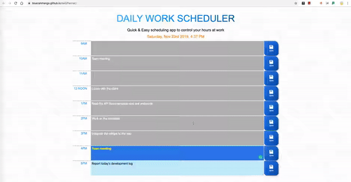

# Daily Work Scheduler
> Manage your work quick & easy! 
🔗 https://bluerainmango.github.io/dailyPlanner/

## 📍Purpose
Individuals can save a to-do list so that they can effectively achieve their hourly & daily goals. 🯠 
Employees can take a look at their work daily and prioritize their task so that it can be improved productively. 💼

## 📌Feature
- The saved data will be stored in your browser and it will be auto-fulfilled when you reopen the app. 
- It is mobile-responsive.
- Content fields automatically change their background colors according to the current time.

## ✨Demo

